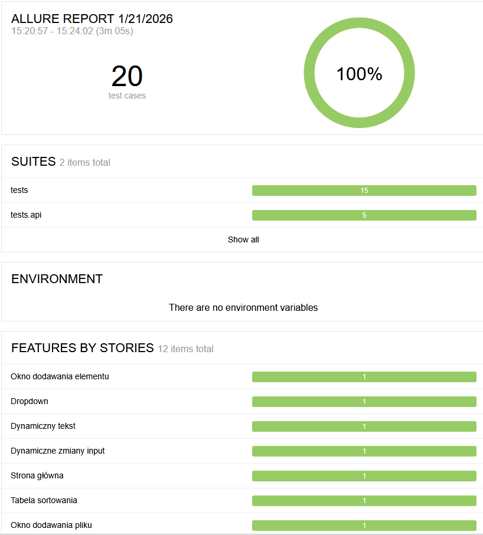
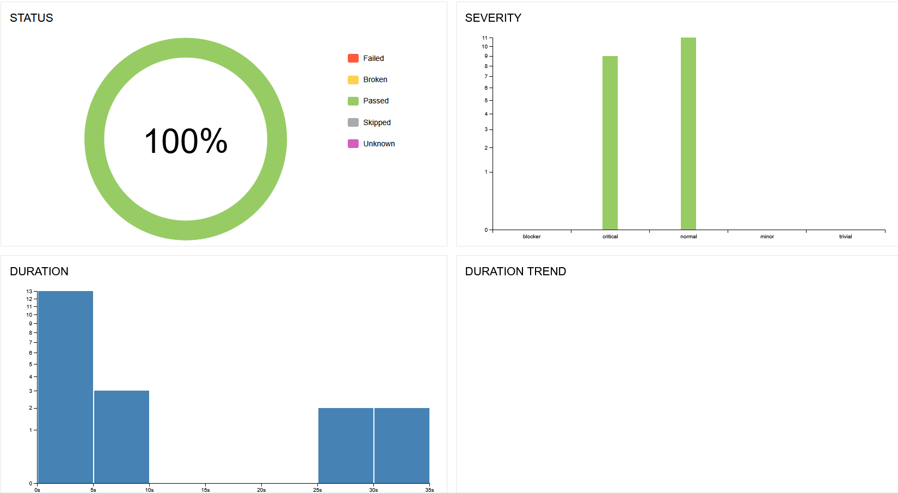
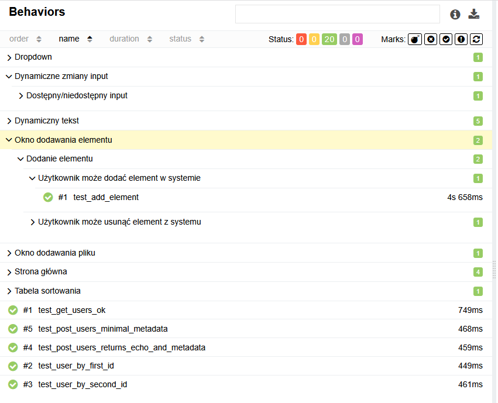
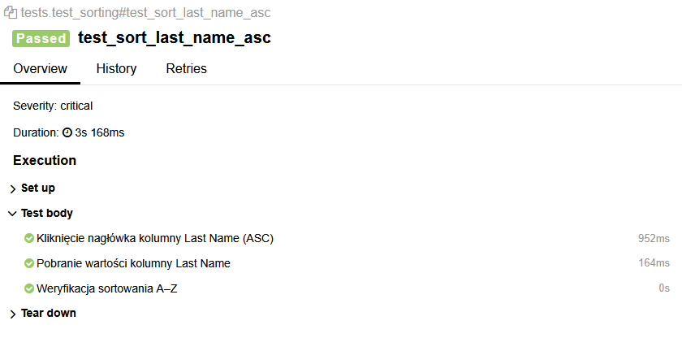

Playwright Python – DoTestHere

Automatyczne testy E2E w Pythonie z użyciem PyTest, Playwright, z raportowaniem w Allure.
Projekt pokazuje dobre praktyki w automatyzacji testów: POM (Page Object Model), parametryzacja testów oraz generowanie raportów.

✅ Wymagania

- Python 3.10+
- Przeglądarki Playwright (`playwright install`)
- (Opcjonalnie) Allure CLI do generowania raportów
- Wersje zgodne z `requirements.txt` (piny aktualnie: pytest 8.1.1, playwright ~1.55, pytest-playwright 0.5.x, allure-pytest 2.13.5)

✅ Instalacja

Windows (PowerShell):
```text
python -m venv .venv
.\\.venv\\Scripts\\activate
pip install -r requirements.txt
playwright install
```
```text
Linux / Mac (Bash):
python -m venv .venv
source .venv/bin/activate
pip install -r requirements.txt
playwright install
```

Minimalny requirements.txt:
```text
pytest==8.1.1
pytest-playwright>=0.5,<0.6
playwright~=1.55.0
allure-pytest==2.13.5
```
✅ Struktura projektu
```text
playwright-python-dotesthere/
├─ pytest.ini
├─ conftest.py              # konfiguracja PyTest i fixture
├─ tests/
│   └─ test_login.py        # przykładowe testy logowania
├─ pages/                   # Page Object Model – klasy stron
├─ utils/                   # funkcje pomocnicze, np. logi i screenshoty
├─ allure-results/          # generowane raporty Allure (nie commitujemy)
└─ allure-report/           # statyczny raport Allure (nie commitujemy)
```
✅ Uruchamianie testów

Podstawowo:
```text
pytest
```
Z logami i zapisaniem wyników do Allure:
```text
pytest -vv -s --alluredir allure-results
```
Uruchom tylko smoke:
```text
pytest -m smoke --alluredir allure-results
```
Uruchom tylko API:
```text
pytest -m api --alluredir allure-results
```
Filtrowanie po nazwie testu:
```text
pytest -k login --alluredir allure-results
```
✅ Raporty Allure

Szybki:
```text
allure serve allure-results
```
Statyczny raport + otwarcie:
```text
allure generate allure-results -o allure-report --clean
allure open allure-report
```
Jedna komenda (Windows PowerShell):
```text
python -m pytest -vv -s --alluredir allure-results; allure generate allure-results -o allure-report --clean; allure open allure-report
```

✅ Artefakty i .gitignore
- `allure-results/`, `allure-report/`, `screenshots/`, `videos/`, `traces/` są generowane w trakcie testów i wykluczone w `.gitignore`.
- W CI wszystkie artefakty są przesyłane jako *Artifacts* oraz publikowane na GitHub Pages (poniżej).

✅ Publiczny raport Allure (GitHub Pages)
- Workflow `.github/workflows/ci-tests.yaml` po każdym runie pakuje `allure-report` i publikuje na GitHub Pages.
- Po pierwszym uruchomieniu trzeba włączyć w repo: *Settings → Pages → Source: GitHub Actions*.
- URL raportu pojawia się w kroku `Deploy to GitHub Pages` (`page_url`) oraz w środowisku `github-pages` w zakładce *Environments*.
- Raport można przeglądać bez pobierania artefaktów.

✅ Uruchamianie z PyCharm

Interpreter: .venv projektu

Run → Edit Configurations → PyTest

Working directory: katalog projektu

Additional Arguments: -vv -s --alluredir allure-results

Environment variables: puste (chyba że potrzebne dla środowiska)

✅ Dobre praktyki w projekcie

POM (Page Object Model): oddzielne klasy dla każdej strony, łatwe do utrzymania i rozbudowy testów.

Parametryzacja testów: testy mogą działać dla różnych danych wejściowych bez powielania kodu.

Logi i screenshoty: przy błędach generowane są screenshoty i logi, widoczne w raportach Allure.

Czytelny kod: sensowne nazwy testów i funkcji, komentarze wyjaśniające krok testowy.

CI: workflow przerywa się, jeśli po uruchomieniu `pytest` nie znajdzie żadnych plików `*-result.json` w `allure-results` – ułatwia to szybkie wykrycie problemu z generacją raportu.

✅ Przykłady raportów







## 🔄 CI/CD – Integracja z GitHub Actions

Ten projekt jest w pełni zintegrowany z **GitHub Actions**, dzięki czemu testy Playwright Python są
automatycznie uruchamiane przy każdym:

- pushu do gałęzi `main`,
- otwarciu lub aktualizacji *Pull Requestu*.

Workflow wykonuje:

1. Instalację środowiska Python i Playwright.
2. Uruchomienie testów Playwright (`pytest`) z raportowaniem Allure.
3. Generowanie artefaktów:
   - `allure-results` – surowe dane raportowe,
   - statyczny raport HTML (`allure-report`).
4. Udostępnienie raportów jako artefaktów w zakładce **Actions → Artifacts**.

Workflow znajduje się w pliku:
```text
.github/workflows/ci-tests.yaml
```

